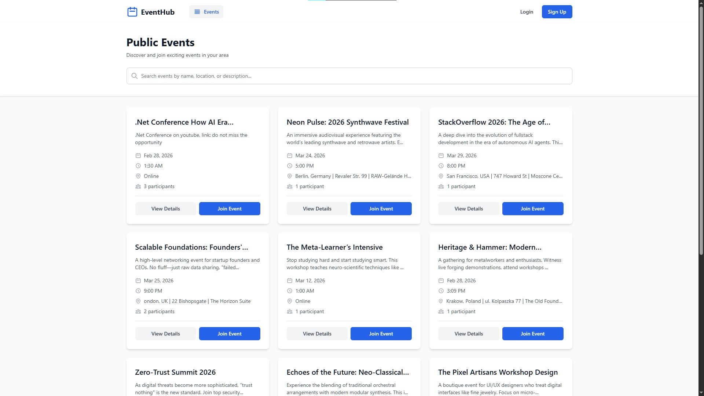
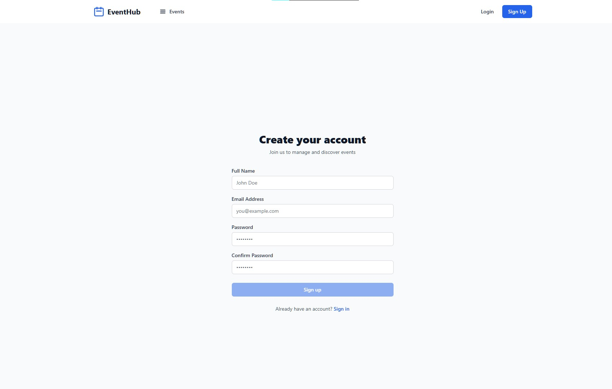
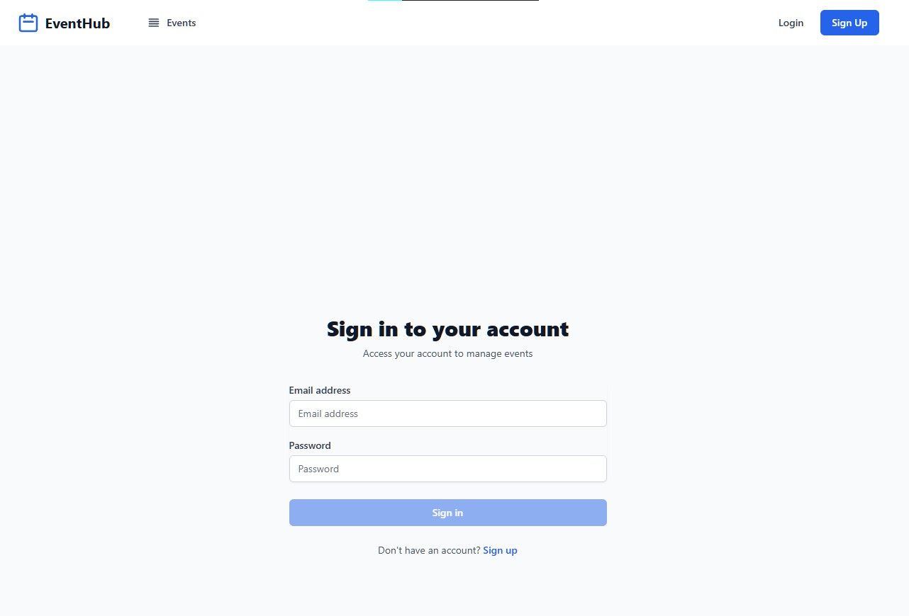
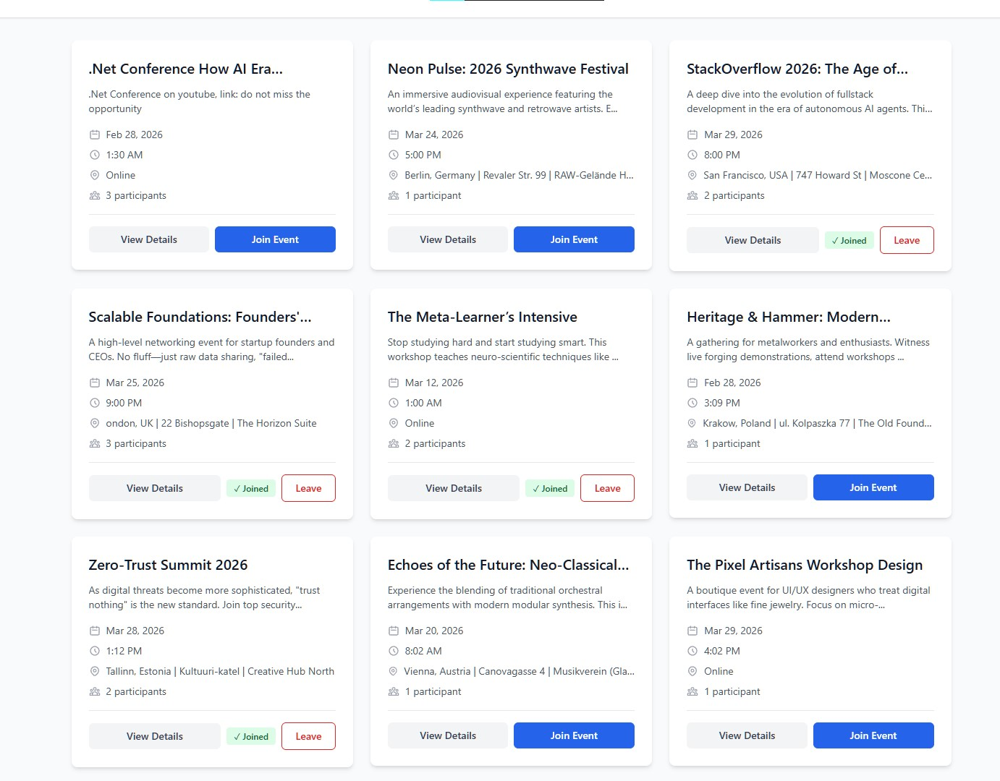
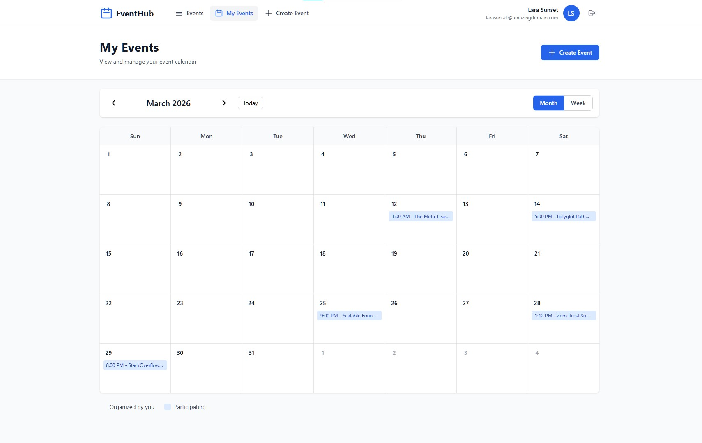
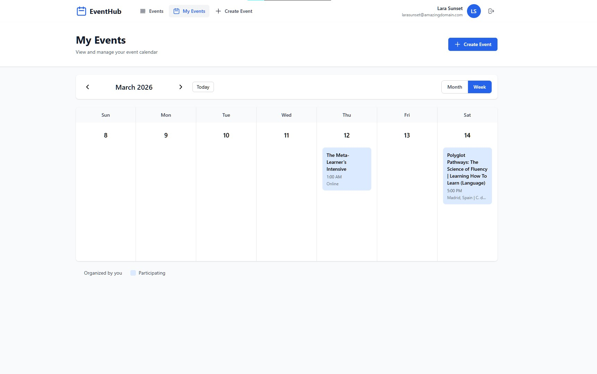
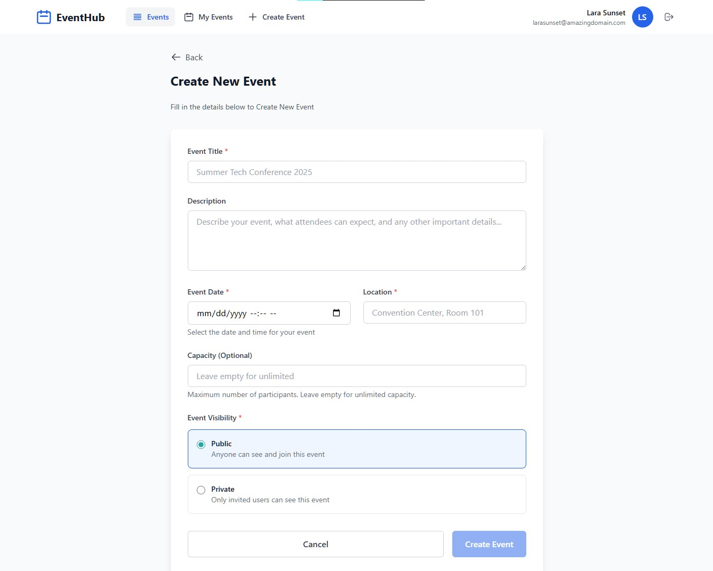
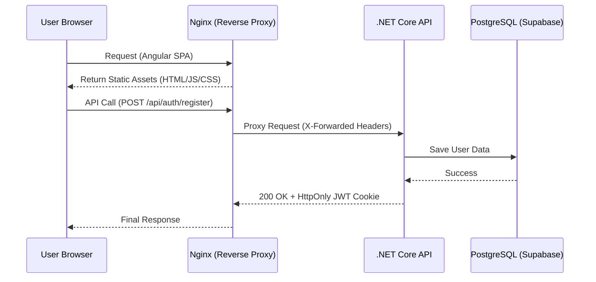

# 📅 EventManagementSystem

**A High-Security, Full-Stack Event Coordination Platform.**

## 🎯 Project Overview

The **Event Management System** is a technical showcase for building scalable, secure, and modern web applications. Designed for public meetups—ranging from IT conferences and business knowledge-sharing sessions to marathons and music concerts—the platform prioritizes data integrity and security through a hardened infrastructure.

---

## 🛠️ Technology Stack

| Layer | Technology |
| --- | --- |
| **Frontend** | Angular 19, TypeScript, Tailwind CSS, Angular Signals |
| **Backend** | ASP.NET Core 9.0 (Web API), Entity Framework Core |
| **Database** | PostgreSQL (Hosted on Supabase) |
| **Infrastructure** | Nginx Reverse Proxy, Docker, Railway Cloud |
| **Security** | JWT (HttpOnly Cookies), XSRF/CSRF Protection, CSP Headers |

---

## 📸 Application Showcase
Public Dashboard

🔐 Secure Authentication
The system utilizes HttpOnly cookies for a seamless and secure experience. This eliminates the risk of token theft via XSS, as sensitive data is never stored in localStorage.

Registration Page

Login Page

👤 User Workspace
Once authenticated, users gain access to a personalized dashboard where they can manage their participation and see events relevant to their profile.

User-Specific Dashboard

📅 Event Management & Planning
Organizers can dynamically manage logistics. The system features a sophisticated calendar view built to help users visualize their schedules across different time scales.

Monthly Calendar View

Weekly Schedule View

Edit Event Interface

## 🏗️ Technical Architecture

This project follows **Clean Architecture** principles to ensure that business logic remains independent of external frameworks.

### **1. Domain-Driven Design (DDD) Layers**

* **Domain:** Pure C# containing core entities (`Event`, `User`, `Participant`) and business constraints.
* **Application:** Use-case logic implemented via a **Service/Repository Pattern**. This layer coordinates data flow without being aware of the DB implementation.
* **Infrastructure:** Handles persistence using **EF Core** and PostgreSQL, implementing the repository interfaces defined in the Application layer.
* **API:** A thin entry-point layer managing HTTP request/response cycles and global error handling.

### **2. Security Implementation (Zero-LocalStorage Policy)**

The application implements a "Zero-LocalStorage" architecture to mitigate XSS (Cross-Site Scripting) risks:

* **JWT Authentication:** The `auth_token` is stored in a **Strict HttpOnly** cookie, making it inaccessible to malicious JavaScript.
* **Dual-Token XSRF Protection:** Implements a double-submit cookie pattern. The server validates an internal `.AspNetCore.Antiforgery` cookie against an `X-XSRF-TOKEN` header sent by the Angular frontend.
* **Content Security Policy (CSP):** Hardened headers restrict where the browser can execute scripts and connect to APIs.

---

## 🔄 System Flow (Infrastructure)

The following diagram illustrates the request lifecycle, highlighting the **Nginx Reverse Proxy** which enables a unified domain and secure cookie handling.

---

## 🚀 Key Engineering Features

* **Complex Reactive Validation:** Angular forms utilize custom Regex validators for passwords/names and cross-field validation (Password Matching), integrated with **Angular Signals** for zero-latency UI feedback.
* **Defensive Cloud Startup:** Implemented a non-blocking background task for **EF Core Migrations**. This ensures the container satisfies cloud health checks (Service Availability) immediately while the database performs schema updates.
* **Nginx Orchestration:** Configured as a bridge between the frontend and backend to solve internal DNS resolution and handle SSL termination.
* **Event Capacity Management:** Real-time logic checks participant counts against event limits before confirming attendance.

---

## 📸 Showcase

> **Note:** Screenshots coming soon!

* **Events Discovery:** A responsive grid of upcoming public meetups.
* **My Events:** A personalized calendar (Monthly/Weekly views) for tracking joined sessions.
* **Organizer Portal:** Secure form for creating and managing event logistics.
* **Auth Suite:** Hardened Sign-up and Login portals with real-time validation.

---

## 🛣️ Roadmap & Future Optimizations

* [ ] **Database Concurrency:** Implement explicit Row Locking (`FOR UPDATE`) for event joining to handle high-concurrency race conditions.
* [ ] **Real-time Updates:** Integrate SignalR for live capacity updates on the event dashboard.
* [ ] **PWA Support:** Enable offline calendar viewing for event participants.

---