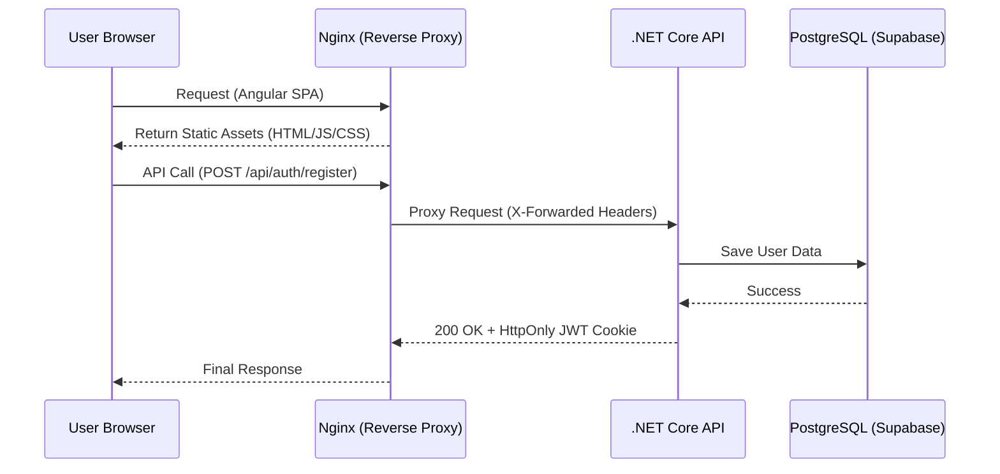
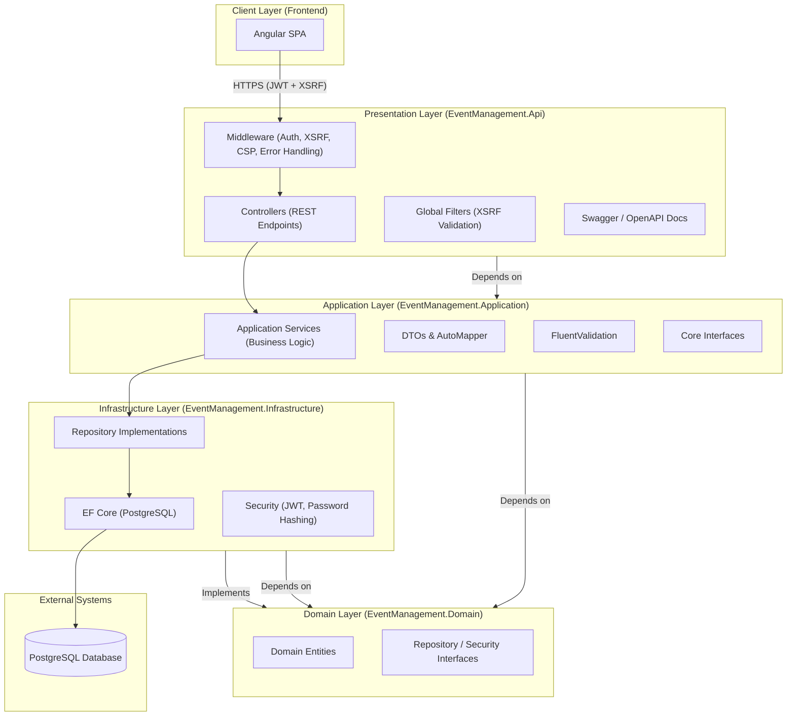

# 📅 EventManagementSystem

**A High-Security, Full-Stack Event Coordination Platform.**

## 🎯 Project Overview

The **Event Management System** is a technical showcase for building scalable, secure, and modern web applications. Designed for public meetups—ranging from IT conferences and business knowledge-sharing sessions to marathons and music concerts—the platform prioritizes data integrity and security through a hardened infrastructure.

Demo link: https://frontend-eventmanagement-production.up.railway.app/events

---

## 🛠️ Technology Stack

| Layer | Technology |
| --- | --- |
| **Frontend** | Angular 19, TypeScript, Tailwind CSS, Angular Signals |
| **Backend** | ASP.NET Core 9.0 (Web API), Entity Framework Core |
| **Database** | PostgreSQL (Hosted on Supabase) |
| **Infrastructure** | Nginx Reverse Proxy, Docker, Railway Cloud |
| **Security** | JWT (HttpOnly Cookies), XSRF/CSRF Protection, CSP Headers |

---

## 📸 Application Showcase
Public Dashboard

🔐 Secure Authentication
The system utilizes HttpOnly cookies for a seamless and secure experience. This eliminates the risk of token theft via XSS, as sensitive data is never stored in localStorage.

Registration Page

Login Page

👤 User Workspace
Once authenticated, users gain access to a personalized dashboard where they can manage their participation and see events relevant to their profile.

User-Specific Dashboard

📅 Event Management & Planning
Organizers can dynamically manage logistics. The system features a sophisticated calendar view built to help users visualize their schedules across different time scales.

Monthly Calendar View

Weekly Schedule View

Edit Event Interface

## 📸 Showcase

* **Events Discovery:** A responsive grid of upcoming public meetups.
* **My Events:** A personalized calendar (Monthly/Weekly views) for tracking joined sessions.
* **Organizer Portal:** Secure form for creating and managing event logistics.
* **Auth Suite:** Hardened Sign-up and Login portals with real-time validation.

---

## 🏗️ Technical Architecture

This project follows **Clean Architecture** principles to ensure that business logic remains independent of external frameworks.

### **1. Domain-Driven Design (DDD) Layers**

* **Domain:** Pure C# containing core entities (`Event`, `User`, `Participant`) and business constraints.
* **Application:** Use-case logic implemented via a **Service/Repository Pattern**. This layer coordinates data flow without being aware of the DB implementation.
* **Infrastructure:** Handles persistence using **EF Core** and PostgreSQL, implementing the repository interfaces defined in the Application layer.
* **API:** A thin entry-point layer managing HTTP request/response cycles and global error handling.

### **2. Security Implementation (Zero-LocalStorage Policy)**

The application implements a "Zero-LocalStorage" architecture to mitigate XSS (Cross-Site Scripting) risks:

* **JWT Authentication:** The `auth_token` is stored in a **Strict HttpOnly** cookie, making it inaccessible to malicious JavaScript.
* **Dual-Token XSRF Protection:** Implements a double-submit cookie pattern. The server validates an internal `.AspNetCore.Antiforgery` cookie against an `X-XSRF-TOKEN` header sent by the Angular frontend.
* **Content Security Policy (CSP):** Hardened headers restrict where the browser can execute scripts and connect to APIs.

---

## 🔄 System Flow (Infrastructure)

The following diagram illustrates the request lifecycle, highlighting the **Nginx Reverse Proxy** which enables a unified domain and secure cookie handling.

---

## 🚀 Key Engineering Features

* **Complex Reactive Validation:** Angular forms utilize custom Regex validators for passwords/names and cross-field validation (Password Matching), integrated with **Angular Signals** for zero-latency UI feedback.
* **Defensive Cloud Startup:** Implemented a non-blocking background task for **EF Core Migrations**. This ensures the container satisfies cloud health checks (Service Availability) immediately while the database performs schema updates.
* **Nginx Orchestration:** Configured as a bridge between the frontend and backend to solve internal DNS resolution and handle SSL termination.
* **Event Capacity Management:** Real-time logic checks participant counts against event limits before confirming attendance.

---

## 🛣️ Roadmap & Future Optimizations

* [ ] **Database Concurrency:** Implement explicit Row Locking (`FOR UPDATE`) for event joining to handle high-concurrency race conditions.
* [ ] **Real-time Updates:** Integrate SignalR for live capacity updates on the event dashboard.
* [ ] **PWA Support:** Enable offline calendar viewing for event participants.

---

## Backend Architecture Overview
The backend of the Event Management System follows a Clean Architecture (also known as Onion Architecture) pattern. This approach ensures high maintainability, testability, and a clear separation of concerns by organzing the codebase into logical layers.

Backend Architecture Diagram
The following diagram illustrates the different layers of the application and how they interact with each other.

Architectural Breakdown
## 1. Presentation Layer (EventManagement.Api)
This is the entry point for the application. It handles HTTP requests and provides responses.

Controllers: Define the RESTful API endpoints.

Middleware: A robust pipeline for cross-cutting concerns:

Authentication: JWT validation with cookie fallback.

Security: Content Security Policy (CSP), XSRF protection, and Secure Headers.

Error Handling: Global exception handling.

Dependency Injection: Orchestrates the wiring of services and repositories.
## 2. Application Layer (EventManagement.Application)
Contains the business logic of the application. It acts as an orchestrator between the API and the Domain.

Services: Implement the use cases (e.g., EventService, UserService).
DTOs: Ensure data is shaped appropriately for the client, hiding internal domain details.

Validators: Use FluentValidation to ensure incoming data is correct before processing.
## 3. Domain Layer (EventManagement.Domain)
The core of the system. It contains the data models and fundamental business rules that are independent of technology layers.

## Entities: Core objects like Event, User, and Participant.
Interfaces: Define the "contracts" for data access (repositories) and security services, implementing the Dependency Inversion Principle.
## 4. Infrastructure Layer (EventManagement.Infrastructure)
Handles technical details and communication with external systems.

Persistence: Managed by Entity Framework Core for interaction with PostgreSQL.

Security: Implementation of JWT token generation and password hashing.

Repository Pattern: Concrete implementations of the interfaces defined in the Domain layer.
## Key Security Features
Identity-Aware: Uses Microsoft Identity concepts with JWT Bearer tokens.

Double-Token XSRF: Implements Antiforgery protection to prevent Cross-Site Request Forgery.

Defense in Depth: Combines CSP headers, HttpOnly cookies, and strict CORS policies.